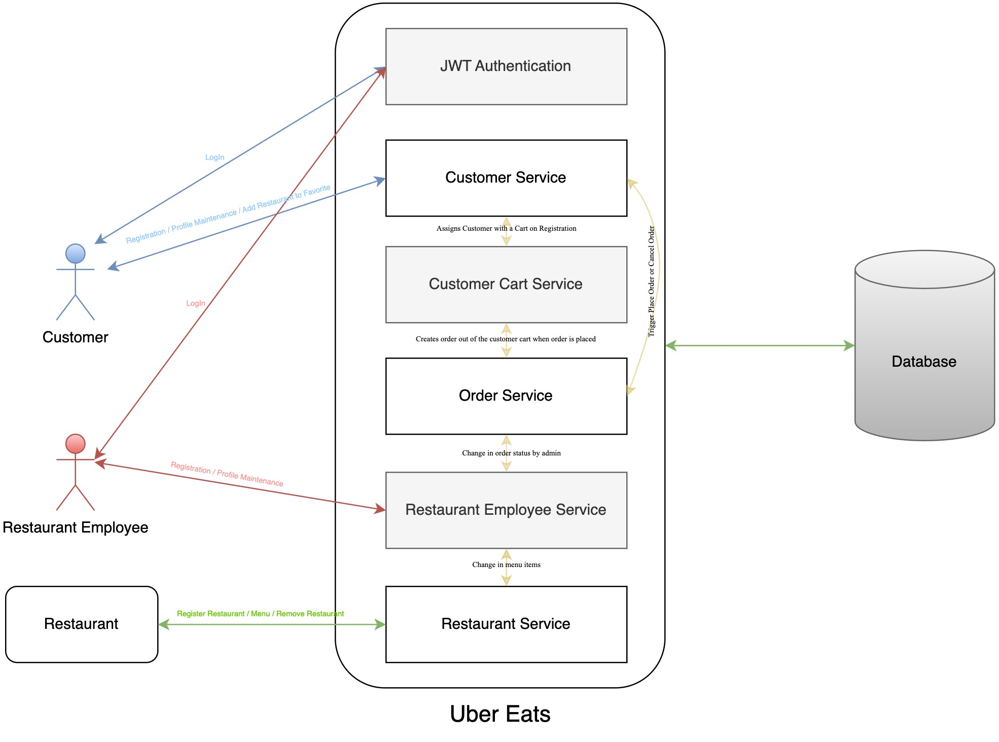

<h1> Uber Eats Backend Clone </h1>

   Entity Relationship Diagram

<h3>Customer Entity</h3>
<table>
<tbody>
<tr>
<td>

<strong>Column</strong>

</td>
<td>

<strong>Explanation</strong>

</td>
</tr>
<tr>
<td>

id (Primary Key)

</td>
<td>

Customer ID. Unique. Not Null.

</td>
</tr>
<tr>
<td>

cart (Foreign Key)

</td>
<td>

ID of the cart which belongs to this customer. The food items added by customers are stored in this cart. When the order is submitted by the customer, the cart's value is calculated, and is put into the customer's order history. Cart is cleared for a fresh order to be built.

</td>
</tr>
<tr>
<td>

address (Foreign Key)

</td>
<td>

Customer&rsquo;s address id stored in address table.

</td>
</tr>
<tr>
<td>

full_name&nbsp;

</td>
<td>

Customer&rsquo;s full name.

</td>
</tr>
<tr>
<td>

email

</td>
<td>

Customer&rsquo;s email. Also used to authenticate customers.

</td>
</tr>
<tr>
<td>

password

</td>
<td>

Authentication password which the customer set&rsquo;s on registration.

</td>
</tr>
<tr>
<td>

contact_number

</td>
<td>

Customer&rsquo;s contact details.

</td>
</tr>
<tr>
<td>

fav_cuisine

</td>
<td>

Customer&rsquo;s favorite cuisine. Restaurant&rsquo;s can be displayed to the customer based on the cuisines for the betterment of user experience.

</td>
</tr>
<tr>
<td>

fav_restaurants

</td>
<td>

Based on past orders, customers can add restaurants to their favorite list.

</td>
</tr>
</tbody>
</table>

<h3>Cart Entity</h3>
<table>
<tbody>
<tr>
<td>

<strong>Column</strong>

</td>
<td>

<strong>Explanation</strong>

</td>
</tr>
<tr>
<td>

id (Primary Key)

</td>
<td>

Cart ID. Not Null. Unique.

</td>
</tr>
<tr>
<td>

food_ids_in_cart

</td>
<td>

When a customer adds food, the ids are stored in the respective cart.

</td>
</tr>
</tbody>
</table>

<h3>Address Entity</h3>
<table>
	<tbody>
		<tr>
			<td>
				

					<strong>
						Column
					</strong>
				

			</td>
			<td>
				

					<strong>
						Explanation
					</strong>
				

			</td>
		</tr>
		<tr>
			<td>
				

					id (Primary Key)
				

			</td>
			<td>
				

					Address ID. Unique. Not Null.
				

			</td>
		</tr>
		<tr>
			<td>
				

					street
				

			</td>
			<td>
				

					Street address
				

			</td>
		</tr>
		<tr>
			<td>
				

					city
				

			</td>
			<td>
				

					City field of address
				

			</td>
		</tr>
		<tr>
			<td>
				

					state
				

			</td>
			<td>
				

					State field of address
				

			</td>
		</tr>
		<tr>
			<td>
				

					pincode
				

			</td>
			<td>
				

					Pincode field of address. City and Pincode fields can be used to show customer restaurants in the area to order from.
				

			</td>
		</tr>
	</tbody>
</table>

<h3>Restaurant Entity</h3>

<table>
	<tbody>
		<tr>
			<td>
				
<strong>Column</strong>

			</td>
			<td>
				
<strong>Explanation</strong>

			</td>
		</tr>
		<tr>
			<td>
				
id (Primary Key)

			</td>
			<td>
				
Restaurant ID. Unique. Not Null.

			</td>
		</tr>
		<tr>
			<td>
				
restaurant_name

			</td>
			<td>
				
Name of the restaurant. Restaurant can be searched based on the name.

			</td>
		</tr>
		<tr>
			<td>
				
cuisine

			</td>
			<td>
				
Cuisine that restaurant serves.

			</td>
		</tr>
		<tr>
			<td>
				
pincode

			</td>
			<td>
				
Pincode where the restaurant is located. Restaurants can be searched based on the pincode.

			</td>
		</tr>
		<tr>
			<td>
				
rating

			</td>
			<td>
				
Customer rating of the restaurant. Can be averaged out and updated with each customer input.

			</td>
		</tr>
		<tr>
			<td>
				
operation_status

			</td>
			<td>
				
If the restaurant is open to delivery at the moment or closed.

			</td>
		</tr>
	</tbody>
</table>

<h3>Food Entity </h3>
<table>
	<tbody>
		<tr>
			<td>
				
<strong>Column</strong>

			</td>
			<td>
				
<strong>Explanation</strong>

			</td>
		</tr>
		<tr>
			<td>
				
id (Primary Key)

			</td>
			<td>
				
Food ID. Unique. Not Null.

			</td>
		</tr>
		<tr>
			<td>
				
restaurant_id (Foreign Key)

			</td>
			<td>
				
Food items belong to a restaurant. This field stores the restaurant ID to which this food item belongs.

			</td>
		</tr>
		<tr>
			<td>
				
item_name

			</td>
			<td>
				
Name of the food item.

			</td>
		</tr>
		<tr>
			<td>
				
item_cost

			</td>
			<td>
				
Cost of the food item.

			</td>
		</tr>
	</tbody>
</table>

<h3>Restaurant Employee </h3>
<table>
	<tbody>
		<tr>
			<td>
				
<strong>Column</strong>

			</td>
			<td>
				
<strong>Explanation</strong>

			</td>
		</tr>
		<tr>
			<td>
				
id (Primary Key)

			</td>
			<td>
				
ID of the employee. Unique. Not Null.

			</td>
		</tr>
		<tr>
			<td>
				
restauranr_id(Foreign Key)

			</td>
			<td>
				
ID of the restaurant with which the employee works.

			</td>
		</tr>
		<tr>
			<td>
				
email

			</td>
			<td>
				
Email of the employee.

			</td>
		</tr>
		<tr>
			<td>
				
phone

			</td>
			<td>
				
Phone number of the employee.

			</td>
		</tr>
		<tr>
			<td>
				
name

			</td>
			<td>
				
Name of the employee

			</td>
		</tr>
		<tr>
			<td>
				
age

			</td>
			<td>
				
Age of the employee

			</td>
		</tr>
		<tr>
			<td>
				
job_role

			</td>
			<td>
				
Job role (Authorization) of the employee. (ADMIN/CHEF/OWNER)

			</td>
		</tr>
	</tbody>
</table>
<h3>Order Entity</h3>
<table>
	<tbody>
		<tr>
			<td>
				
<strong>Column</strong>

			</td>
			<td>
				
<strong>Explanation</strong>

			</td>
		</tr>
		<tr>
			<td>
				
id (Primary Key)

			</td>
			<td>
				
Order ID. Unique. Not Null.

			</td>
		</tr>
		<tr>
			<td>
				
customer_id (Foreign Key)

			</td>
			<td>
				
ID of the customer who has submitted the order request. This helps to fetch the order history of the customer.

			</td>
		</tr>
		<tr>
			<td>
				
restaurant_id (Foreign Key)

			</td>
			<td>
				
ID of the restaurant to which the order was submitted.

			</td>
		</tr>
		<tr>
			<td>
				
food_ids_in_order

			</td>
			<td>
				
IDs of the food items which are part of order.

			</td>
		</tr>
		<tr>
			<td>
				
item_count

			</td>
			<td>
				
Total number of food items in this order.

			</td>
		</tr>
		<tr>
			<td>
				
total_price

			</td>
			<td>
				
Total cost of this order. (Tax calculated using the tax table.)

			</td>
		</tr>
		<tr>
			<td>
				
order_status

			</td>
			<td>
				
Status of the order. Can only be changed by restaurant admin. Authorization involved.

			</td>
		</tr>
	</tbody>
</table>

<h2>Context Diagram</h2>

<h2>Container Diagram</h2>

   Container Diagram